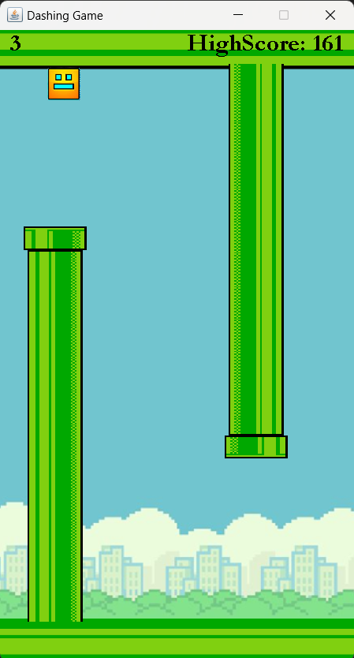

# Square_Dashing_Game

# Overview
Dashing Game is a fast-paced, side-scrolling game where you control a square character as it tries to dash through the gaps between moving pipes.  Inspired by classic arcade games, this game challenges players with increasing difficulty, requiring them to master quick reactions and timing.

# Game Interface

# Features
**Dynamic Pipes:** Pipes move from right to left, with random gaps that you must dash through.  
**Increasing Difficulty:** Speed increases over time, making the game progressively more challenging.  
**High Score Tracking:** Keep track of your best performance between game sessions.  
**Pause & Resume:** You can pause and resume the game at any time using the ESC key.  
**Restart Mechanism:** After game over, press SPACE to restart the game.  
**Background Music:** Enjoy looping background music to accompany your gameplay.  

# How to Play
**Spacebar:** Press to jump or fall.  
**ESC:** Press to pause or resume the game.  
**Score:** Each successful pass through a pipe increases your score by 1.  
**High Score:** Your highest score will be saved automatically and displayed in the game.  

# Game Controls
**Spacebar:** Toggle between moving upwards (jump) or falling downwards.  
**ESC:** Pause the game or resume the game if already paused.  

# Requirements
Java Development Kit **(JDK)** 8 or above.  
**Sound and Image files:**   
**background.wav:** Background music for the game.  
**Background.png:** Image for the game background.  
**TopPipe.png:** Image for the top pipe.  
**BottomPipe.png:** Image for the bottom pipe.  
**SquareImg.png:** Image for the square character.  
Ensure these files are present in the resource folder or the root directory where the .java files are located.  

# Contributing
Feel free to open issues or submit pull requests if you have any ideas to improve the game!
